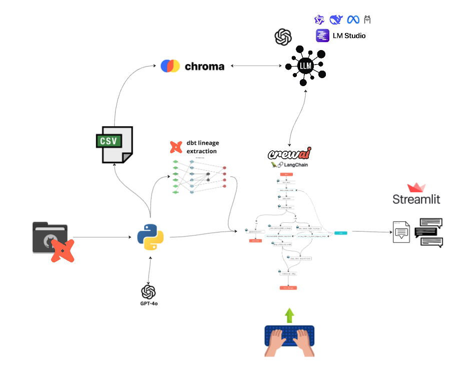
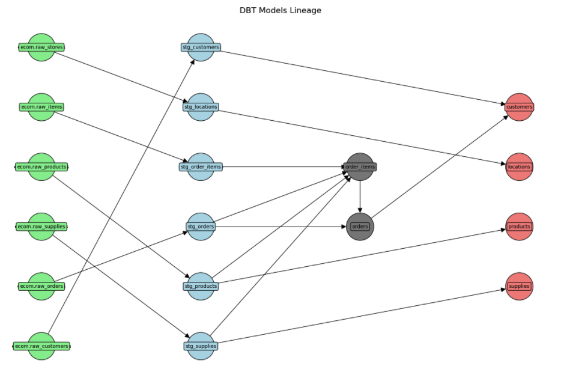
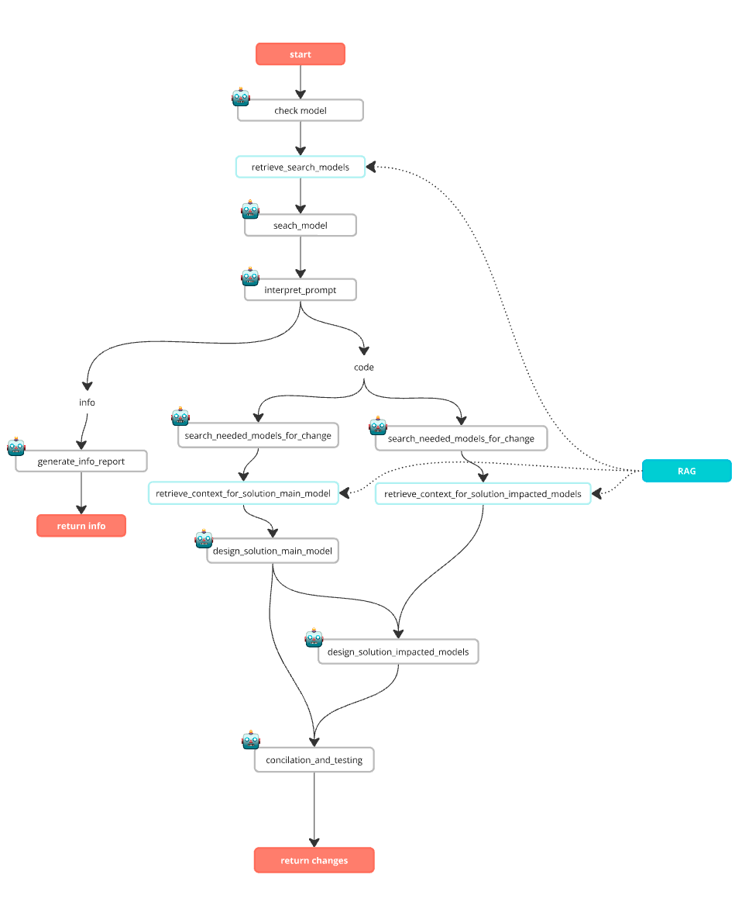
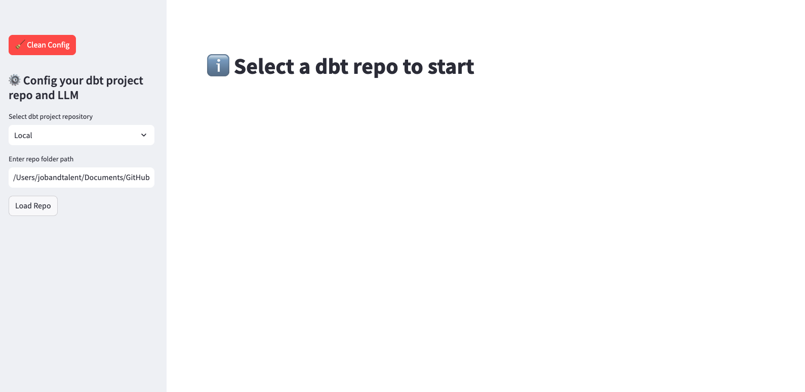
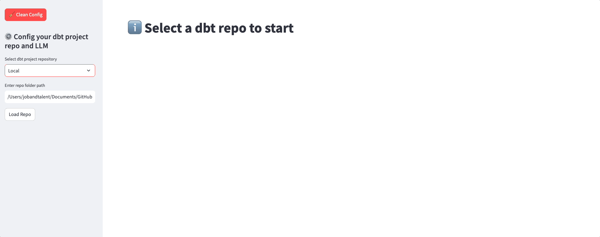
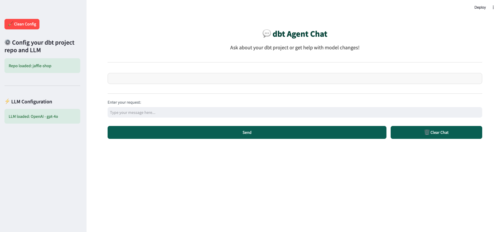

# llm-rag-dbt


## Overview
This project provides a Retrieval-Augmented Generation (RAG) system designed to enhance LLM agents' understanding of dbt project structures. It retrieves context on models, dependencies, and documentation, allowing agents to generate, refine, and modify code step-by-step with project-specific accuracy. This approach minimizes hallucinations and improves responses by leveraging the full context of the repository.

## Problem Statement
Managing and modifying dbt projects can be challenging due to their complexity and interdependencies. This system aims to bridge the gap by equipping LLM agents with comprehensive knowledge of dbt models, enabling more accurate suggestions and modifications.

## Technologies

- **Python**: Core language used for processing and orchestrating the system.
- **dbt**: Framework for managing and transforming data in warehouses. We will use a dbt repo as knowledge source.
- **ChromaDB**: Efficient vector database for storing and retrieving document embeddings.
- **CrewAI**: Framework for structuring multi-agent AI workflows.
- **LangChain**: Provides integration and chaining capabilities for LLM interactions.
- **LM Studio**: Used to run and support local LLM models.
- **LLM Models**: Configured to use the models available in the Open aI APi (mainly gpt-4o and gpt4o-mini) and local models (tested with DeepSeek R1 Q4_K_M, Qwen2.5 Coder 7B Instruct Q4_K_M and Llama 3.2 3B Instriuct 4bit).
- **streamlit**: Displays the interface of the tool and the interactions made with the Agents Flow.

## Project Phases

1. **Data Collection**: Extract information from a repository that can be either online or local.
2. **Data Cleaning**: Format and clean the repository content, its structure, and the code/documentation of all models, macros, project files, snapshots, etc.
3. **Data Analysis**: Analyze relationships between models in the dbt project and add them to the processed information. Generate textual descriptions of the code, macros, models, and project to provide an easily interpretable source for the RAG system. Format all data into a document containing all necessary information for each model for later storage in a vector database.
4. **Data Storage**: Process the formatted documents by dividing them into chunks and storing them in ChromaDB, which will serve as the database for the RAG system.
5. **LLM Agents Flow**: Configure an agent flow using CrewAI, where agents analyze and process requests step-by-step, querying the RAG for the necessary information at each stage.
6. **Tool and Visualization**: Implement an interface in Streamlit to enable easy interaction with all functionalities, formatting input and output from the agent flow as a chat interface.


## Folder Structure

```bash

llm-rag-dbt/
│
├── chromadb/                     # ChromaDB storage
├── config/                       # Configuration files
│   ├── agents.yml                 # Agent definitions and roles
│   └── tasks.yml                  # Task definitions for agent workflow
│
├── data/                          # Sample and processed data
│
├── notebooks/                     # Jupyter notebooks for development and testing
│   ├── create_rag_db.ipynb         # Notebook to generate the RAG database
│   ├── generate_knowledge.ipynb    # Notebook for extracting insights
│   ├── interface_design.ipynb      # UI/UX design for interaction
│   ├── llm_agents_tests.ipynb      # Agent behavior and response validation
│   └── llm_chain_tests.ipynb       # Testing the multi-agent workflow
│
├── src/                          # Source code
│   ├── create_rag_db.py           # Scripts to generate RAG database
│   ├── enhanced_retriever.py      # Improved retriever class
│   ├── generate_knowledge.py      # Knowledge extraction scripts
│   ├── interface_app.py           # Streamlit app interface
│   ├── llm_agents_flow.py         # Agent orchestration logic
│   ├── llm_chain.py               # Chaining of agents and context handling
│   └── llm_chain_tools.py         # Utility functions for LLM chain operations
│
├── test_repo/                     # Sample dbt project for testing
├── img/                           # Images and GIFs for README
│
├── requirements.txt             # Dependencies (pandas, scikit-learn, scrapy, etc.)
├── environment.yml              # Conda environment configuration
├── openai_setup.yml             # Keys for co (dont sync it in your repo!)
├── .gitignore                   # Ignore unnecessary files
└── README.md     

```

## Phases of the project



### Data Collection

We will select a repository from a dbt project, to process and clean up the structure and content of the repository, and use it as a knowledge base to give context to our LLM when making requests from the interface.

> **‼️👀🚨 IMPORTANT 🚨👀‼️**: The dbt project must be structure following the dbt best practices. If the models folder or project main files are not set as expected, the python script could not read them properly, so the context of this files wouldn't be added to the RAG context. Adapt the code if your repo structure differs.

#### Data Source Options

- **Local repository**: Select the path to the local repository you want to process. The test_repo folder contains an example using jaffle-shop, from dbt labs.
- **Online repository**: Enter the url of the repository to read, the scrit will read the structure and content automatically using the GitHub api and the requests library.
- **Already processed repository**: If you have already used a repository before, load it directly by selecting the corresponding dbt_models_knowledge file that will have been created in the data folder, in order to reuse the already processed data and speed up the process.

### Data Cleaning

Once the dbt repository is obtained, whether from a local path or an online source, the next step is cleaning and structuring the content. The project begins by identifying all relevant files within the repository, such as models, macros, snapshots, and documentation. This process ensures that only meaningful elements are processed.

#### 1. Repository Structure Analysis
- The repository's file structure is listed recursively, distinguishing between different file types such as `.sql`, `.yml`, `.csv`, and excluding irrelevant files.
- If the repository is hosted online (e.g., GitHub), the GitHub API is used to dynamically extract the file list.

#### 2. Filtering dbt Elements
- Specific dbt-related files are filtered using predefined extensions.
- Files within the `models/` directory are categorized separately from other project-level files.

#### 3. Model Dataframe Creation
- A structured DataFrame is built to store metadata about each model, including file paths, extensions, and names.
- Snapshot models are moved to the model section to align with dbt's internal categorization.

#### 4. Content Extraction
- Each relevant file is read and processed based on its type:
  - **SQL files** are formatted and analyzed for key components such as Jinja templates, materialization strategies, and dependencies.
  - **YAML files** are parsed to extract metadata, descriptions, and tests.
  - **CSV files** are cleaned and standardized to ensure compatibility with dbt's expectations.

#### 5. Configuration Parsing
- SQL models are examined for `config()` blocks to identify materialization settings and snapshot strategies.
- Jinja macros within the models are identified and categorized.

#### 6. Metadata Enhancement
- Relationships between models are analyzed by identifying dependencies using `ref()` and `source()` functions.
- Models are categorized based on naming conventions (e.g., `base`, `stg`, `int`).
- Columns, tests, and other metadata extracted from YAML files are matched with corresponding models.

#### 7. Project-level Details
- The `dbt_project.yml` and other project configuration files are parsed to extract global settings, package dependencies, and custom configurations.
- Packages are documented and their purposes summarized.

### Data Analysis

Once the data has been cleaned and structured, the next step involves analyzing relationships, dependencies, and generating meaningful insights for the RAG system. 



#### 1. Relationship
- Extract relationships between models by analyzing `ref()` and `source()` functions within SQL code.
- Identify parent-child relationships between models to better understand project dependencies.

#### 2. Generating Descriptions with LLM
- A language model (GPT-4o) is used to generate concise, human-readable descriptions of each model, macro, and project configuration.
- The descriptions summarize key aspects such as:
  - **Purpose:** What the model/macro is designed to do.
  - **Dependencies:** Which tables or models it interacts with.
  - **Filters/Aggregations:** Any key transformations performed within the model.

#### Setup Instructions
1. **API Key**: To enable the GPT functionality, you'll need an API key from OpenAI. If you haven’t done so already, sign up for an API key at [OpenAI's website](https://platform.openai.com/signup).
   
2. **Configuration File**: In the project’s root directory, create or locate the `openai_setup.py` file. Replace the placeholders with your OpenAI credentials as shown below:

```python
   conf = {
       'organization': 'your_organization_key_here',
       'project': 'your_project_key_here',
       'key': 'your_openai_api_key_here'
   }
```

**Important**: Ensure that openai_setup.py is included in your .gitignore file to keep your API key secure and prevent accidental exposure in public repositories.

**Usage Notes**
- **Data Privacy:** Be mindful that enabling the GPT API may send review text to OpenAI’s servers. Consider reviewing OpenAI’s data usage policy to understand how your data is handled.
- **API Costs:** Since the GPT API is a paid service, usage may incur costs. Track your usage on the OpenAI dashboard to manage API expenses.

#### 3. Jinja Code
- The LLM is leveraged to analyze Jinja code within SQL models and macros.
- The extracted Jinja blocks are explained with details on their functionality and impact on the transformation logic.

### Data Storage

The final processed data is formatted into structured documents containing enriched information, making it easier to query and retrieve insights efficiently. This data is divided into meaningful chunks, preparing it for storage in the vector database (ChromaDB) for the RAG system.

### LLM Agents Flow

Once the data has been cleaned and analyzed, an LLM agent flow is configured to handle requests related to the dbt project. The flow utilizes CrewAI to coordinate multiple agents, each responsible for specific tasks such as retrieving context, analyzing relationships, and generating insights or code suggestions.



#### 1. Flow Initialization
The flow starts by loading agent and task configurations from YAML files. These configurations define the roles and responsibilities of each agent, ensuring they align with the project requirements. Agents include:

- **Check Model Agent:** Analyzes the requested model to understand its dependencies and usage.
- **Search Model Agent:** Locates relevant models related to the user's request.
- **Interpretation Agent:** Interprets the user prompt to determine the appropriate action.
- **Solution Design Agent:** Generates solutions based on the identified dependencies and context.
- **Conciliation and Testing Agent:** Validates the proposed solution to ensure alignment with project goals.

#### 2. Task Execution Flow
The agent flow follows a structured pipeline where each agent processes and refines the request iteratively. The sequence of tasks includes:

1. **Model Identification:**  
   - The `check_model_agent` analyzes the lineage of the requested model.
   - The identified models and their dependencies are retrieved from the vector database (ChromaDB).

2. **Context Retrieval:**  
   - Using the vector store, relevant documentation and code snippets related to the identified models are fetched.
   - Upstream and downstream models are identified to ensure complete impact analysis.

3. **Prompt Interpretation:**  
   - The interpretation agent decides whether the request is related to retrieving information or generating new code.

4. **Information Generation:**  
   - If information is requested, the agent compiles documentation and generates a report.
   - If code changes are needed, further agents analyze the impact and design the required modifications.

5. **Solution Design and Testing:**  
   - Based on the gathered context, the solution design agent proposes changes.
   - The conciliation agent tests the proposed changes against project constraints and dependencies.

#### 3. Interaction with the Vector Store
A key component of the flow is the integration with ChromaDB, which stores processed information in a structured format. The flow interacts with the database to:

- Retrieve documents related to the queried model.
- Analyze lineage to determine affected models.
- Provide additional context to the agents for informed decision-making.

#### 4. Routing and Decision Making
The flow utilizes dynamic routing to determine the appropriate response path based on user intent. For instance:

- If the request pertains to retrieving insights, the system compiles reports.
- If modifications are needed, the system triggers a series of tasks to suggest, validate, and refine the changes.

#### 5. Finalizing Results
After the necessary processing, the final output (either an information report or code suggestions) is compiled and presented to the user in an accessible format via a Streamlit interface.

This structured agent flow ensures that every step of the process is handled efficiently, leveraging the full context of the dbt project while minimizing errors and improving response quality.

### Streamlit Interface and Tool Use

The Streamlit interface provides an intuitive way to interact with the RAG system for dbt projects, allowing users to load repositories, configure language models, and interact with the agent flow in a chat-like environment.

1. **Running the App**  
   To start the application, run the following command in your terminal, navigating to your project’s root directory:

```bash
   streamlit run src/interface_app.py
```



2. **Load Repo Options**  
The interface allows users to select how they want to load their dbt project repository. There are three options available in the sidebar:

- **Local:**  
  Users can provide the local path to their dbt project folder. The system will recursively analyze and extract information from the project structure.
- **Online:**  
  Users can enter the URL of a public GitHub repository containing their dbt project. The app will fetch the necessary files and analyze them remotely.
- **Already Used:**  
  If a project has been processed previously, users can upload pre-processed `.csv` files containing the knowledge extracted from the dbt project. This option speeds up the workflow by avoiding repeated processing.

After selecting an option and providing the necessary inputs, clicking the **"Load Repo"** button will process the repository and prepare it for further analysis.



3. **Load LLM Options**  
Once the repository is loaded successfully, the interface provides options to select and configure the Language Model (LLM). Two primary LLM options are available:
- **OpenAI Models:**  
  Users can select from predefined models such as `gpt-4o-mini` or `gpt-4o`. These models provide cloud-based AI capabilities for processing and generating responses.
- **Local LLM with LM Studio:**  
  If users have a local LLM instance running on their machine via LM Studio, the app detects available models from the local API and allows selection.

#### How to Set Up LM Studio for Local LLM  
If you prefer to run the LLM locally, follow these simple steps to set up LM Studio:

1. **Download and Install LM Studio:**  
   - Visit [LM Studio](https://lmstudio.ai/) and download the installer for your operating system.  
   - Follow the installation instructions to set it up on your machine.

2. **Download a Model:**  
   - Open LM Studio and navigate to the **Models** section.  
   - Search for a model (e.g., `LLaMA`, `Mistral`, `Mixtral`) and click **Download**.  
   - Ensure the model is compatible with your hardware capabilities.

3. **Run LM Studio in Server Mode:**  
   - Once the model is downloaded, go to the **Server** tab in LM Studio.  
   - Click **Start Server**, and ensure it is running on `http://127.0.0.1:1234`.  
   - The app will automatically detect available models when selecting "Local LLM" in the interface.

After choosing the preferred model, clicking the **"Load LLM"** button initializes the agent flow for processing requests.



4. **Chat Interface**  
The chat interface is the primary way to interact with the loaded dbt project. It consists of:

- **Input Field:**  
  Users can type questions related to their dbt project, such as "What does the customer_orders model do?" or "What are the dependencies of the sales model?"
- **Response Display:**  
  Responses from the LLM agents appear in a structured format, providing insights, dependencies, and explanations about the dbt models and macros.
- **Conversation History:**  
  Previous interactions are stored within the session, allowing users to track their queries and responses over time.
- **Clear Chat Button:**  
  Users can reset the conversation at any time by clicking the clear chat button to start fresh.

### ⚠️ Disclaimer  

The accuracy and quality of the results generated by this system depend heavily on the computational power and capabilities of the selected LLM model.  
Please note that the **average inference time is around one minute**, but it can vary significantly based on:  
- The complexity of the request.  
- The size and structure of the dbt repository being analyzed.  
- The number of interactions required between multiple agents and the LLM to construct a comprehensive response.  
For optimal performance, consider using a high-performance LLM model and a well-structured dbt repository.

